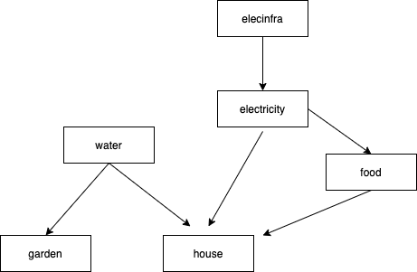

# Development Stages via git branch naming convention

## Usage

Set the access tokens to download from the git hubs (GitHub, Gitlab) with read 
privilege for the repositories in question.

```
Sys.setenv("GITHUB_PAT" = "<token>")
Sys.setenv("ROCHE_GITHUB_PAT" = "<token>")
Sys.setenv("ROCHE_GITLAB_PAT" = "<token>")
```

You can have these tokens set permanently by putting the information into the `~/.Renviron` file, e.g. by 
calling `usethis::edit_r_environ()`:

```
GITHUB_PAT=<token>
ROCHE_GITHUB_PAT=<token>
ROCHE_GITLAB_PAT=<token>
```

Roche specific: Put this into your `~/.Rprofile` (by calling `usethis::edit_r_profile()`):
```
options(
  staged.dependencies.token_mapping = c(
    "https://github.com" = "GITHUB_PAT",
    "https://gitlab.com" = "GITLAB_PAT",
    "https://github.roche.com" = "ROCHE_GITHUB_PAT",
    "https://code.roche.com" = "ROCHE_GITLAB_PAT"
  )
)
```
For example, the environment variable `GITHUB_PAT` contains the token for `https://github.com`.
You can also call this later once the package is loaded.

Search for the addins of this package:
- Install Upstream Dependencies and this Package: Install remote upstream dependencies
  and the local version of this package.
- Install All Dependencies: Opens a Shiny application to unselect those 
  dependencies that should not be installed. The feature input element can be empty 
  in which case it takes the branch name as the feature.
- Check and Install Downstream Dependencies: Checks the downstream dependencies.
  It installs them as well as their upstream dependencies. It picks up the
  environment variable `RCMDCHECK_ARGS` and passes it as arguments to `R CMD check`.
  
- Test and Install Downstream Dependencies: See above. It tests instead of checks.

If you are working locally on a collection of packages, you can modify the `~/.staged.dependencies/config.yaml` to
automatically pick up the local packages that should be taken instead of their remote ones.
For the current project, the local rather than remote version is always taken.
The directory `~/staged.dependencies` as well as a dummy config file are created whenever the package is loaded and 
the directory does not exist.

Moreover, these functions are also implemented as RStudio jobs.

For the branch naming strategy, see `staged.dependencies::determine_branch` and
the section below.

You can run the actions of the addins explicitly and change the default arguments:

```{r}
# latex may not be installed, so `R CMD check` does not fail because of it
Sys.setenv(RCMDCHECK_ARGS = "--no-manual")

check_downstream(
  project = "../stageddeps.electricity"
)

install_upstream_deps(project = "../stageddeps.electricity", verbose = 1)

check_downstream(
  project = "../stageddeps.electricity", 
  downstream_repos = list(list(repo = "maximilian_oliver.mordig/stageddeps.house", host = "https://code.roche.com"))
)

install_upstream_deps(project = "../stageddeps.house", feature = "fix1@feature1@master", verbose = 1)
```

Remember to restart the R session after installing packages that were already loaded.

## Branch Naming / Workflow

Suppose one implements a new feature called `feature1` that involves `repoB, repoC` with the dependency 
graph `repoA --> repoB --> repoC`, where `repoA` is an additional upstream dependency. One then notices that 
`feature1` requires a fix in `repoB`, so one creates a new branch `fix1@feature1@devel` on `repoB`. 
The setup can be summarized as follows:
```
repoB: fix1@feature1@devel, feature1@devel, devel
repoC: feature1@devel, devel
repoA: devel
```
A PR on repoB `fix1@feature1@devel --> feature1@devel` takes 
`repoB:fix1@feature1@devel, repoC: feature1@devel, repoA: devel`. 
This can be checked by setting `feature = fix1@feature1@devel` and running `R CMD check` on `repoC`, 
or `check_downstream` on `repoB` (adding `repoC` to its downstream dependencies).
The PR on `repoB` and  `repoC` `feature1@devel --> devel` takes 
`repoB:feature1@devel, repoC: feature1@devel, repoA: devel`, setting `feature = feature1@devel`.

## Functioning of the Package
Given a feature and a git repository, the package determines the branch to checkout according to the branch
naming convention. To get the upstream or downstream dependencies, it inspects the `staged_dependencies.yaml` file.
This file is of the form:
```
---
upstream_repos:
- repo: Roche/rtables
  host: https://github.com
- repo: Roche/respectables
  host: https://github.com

downstream_repos:
- repo: NEST/test.nest
  host: https://github.roche.com
- repo: nest/tlg.standards
  host: https://code.roche.com

current_repo:
  repo: openpharma/staged.dependencies
  host: https://github.com
```
It contains all the information that is required to fetch the repos. The `current_repo` lists the info to fetch the
project itself.
Each package is cached in a directory whose name is based on `repo` and a hash of `repo, host`. 
If it exists, it fetches. Otherwise, it clones. 
The repositories only have remote branches, the default tracking branch is deleted. Otherwise,
there would be problems if the default branch is deleted from the remote, checked out locally, so 
`git fetch --prune` would not remove it and the local branch would be among the available 
branches considered in `determine_branch`.

If a repo is part of the local packages, it is not fetched, but instead copied to the cache dir. A commit is created
with all files (including staged, unstaged and untracked, but excluding git-ignored) files.
Given such a cache directory, the commit hash is added to the `DESCRIPTION` file and the package is installed, unless
the package is already installed with the same commit hash.
When calling `install_deps` and similar functions, the current project is always added to the `local_repos` so that
its local rather than remote version is installed.
For this, the `current_repo` field must be correct, so downstream dependencies do not fetch the remote version.

## Troubleshooting

`git2r::clone` may fail. Check that the git host is reachable (VPN may be needed) and that the access token 
has read privileges for the repositories.

## Example Setup

This package can be tested on the following setup of packages.


See https://code.roche.com/maximilian_oliver.mordig/stageddeps.water and the related packages.

You can check that the right branches of the packages are installed with:

```{r}
stageddeps.house::get_house()
stageddeps.water::get_water()
stageddeps.garden::get_garden()
stageddeps.food::get_food()
stageddeps.elecinfra::get_elecinfra()
stageddeps.electricity::get_electricity()
```
